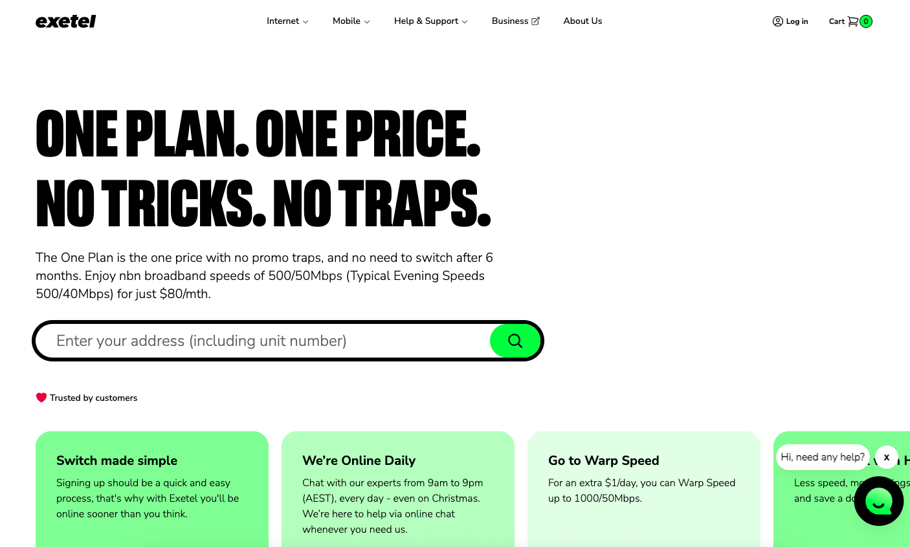
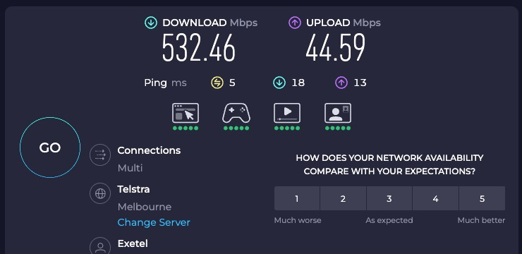

最近終於轉換了新的澳洲家居寬頻，今次轉換讓我覺得非常值得分享。原本使用 Origin Broadband，每個月月費要 AU$95，相當於 HK$500 左右，但只有 50Mbps 網速，看 YouTube 時經常會出現卡頓，真的令人頭痛。雖然前半年有半價優惠，但過後就恢復原價，上網又貴又慢，忍不住決定轉換。

今次想要和大家分享我的轉換經驗，包括為什麼要轉換、轉換過程如何，以及轉換後的感受。希望可以幫助到同樣遇到寬頻問題的朋友。

## 當初為什麼選擇 Origin？

其實一開始選擇 Origin 是因為當初剛來澳洲申請電力時，見到 Origin 有提供寬頻服務，頭半年半價優惠，而且還送 eero Router。當時想搬屋第一天就有寬頻，又不想買 router，不知道哪些支援哪些不支援，所以就選擇了 Origin。

前半年確實很划算，每個月只需要 $47.5，而且還免費獲得了一個 eero Router。但網速真的不太理想，只有 50Mbps，平時觀看 YouTube 1080p 都會偶爾卡頓，如果家裡有人同時使用其他設備，網速就會更加緩慢。

最讓我困擾的是，過了半年優惠期之後，月費立刻升到 $95，但網速完全沒有改善。經常想著，每個月支付這麼多錢，但連基本的影片串流都不夠順暢，下載東西也很慢，真的很不值得。

於是我開始上網尋找其他選擇，看看有沒有更好的寬頻服務。經過一番比較，發現 Exetel 有個不需要簽約的計劃，$80 一個月就有 500Mbps，而且沒有隱藏收費，真的很吸引人。

## 發現 Exetel 優惠計劃

有一天上網看到 Exetel 推出了新計劃，$80 一個月就有 500Mbps 下載速度，而且不需要簽約，可以隨時取消。這個計劃真的很適合我，因為我不想再被合約綁住，而且網速提升了十倍，價錢還便宜了 $15。

最讓我驚喜的是，我發現 Cashrewards 有 $120 現金回贈，可以 cover 回 router 的錢，幾開心。平時都有使用現金回贈平台，但通常都是購物才有，這次連寬頻都有，真的很難得。

於是我決定立即申請。申請之前有些擔心，因為從來沒有試過轉換寬頻，不知道流程如何，會不會很麻煩。但想到可以省錢並且提升網速，就決定試試看。

## 轉換過程分享

轉換過程其實比我想像中簡單很多。首先我去了原有的 Origin 帳戶查看取消條款，聯絡了客服，他們說未夠 24 個月所以要賠 router 錢，每個月 $6。我計算了一下，其實我當是百幾蚊買 router 又 ok。

然後我就去 Cashrewards 開啟 Exetel 的 cashback tracking，確保可以獲得現金回贈。接著進入 Exetel 官網，輸入家裡地址，看看是否支援。Exetel 官網有寫明要保留 active，所以我就沒有即時取消，想著等 Exetel 通了後再打電話去 Origin 取消。

幸好我的地址支援，立刻看到 $80/500Mbps 的計劃。付款頁面需要填寫的資料都很簡單，主要是個人資料、地址，以及最重要的要輸入原公司計劃的 AVC 編號。這個編號是用來識別你的寬頻連接，通常可以在帳單找到，如果找不到就打電話去問。

選擇付款方式之後，我付完錢，等了大概十分鐘就轉換完成。整個過程只是斷線兩三分鐘，Origin 之後自動寄送最後一張帳單過來，整個轉換過程就完成了。真的沒想到會這麼順利，原本以為會很麻煩，但實際上很簡單。

## 轉換後的使用感受

轉換到 Exetel 之後，網速真的有明顯改善。以前觀看 YouTube 經常會卡頓，現在觀看 4K 都完全沒有問題，網速都保持穩定，不會再出現以前那麼慢的情況。

下載速度也提升了很多，以前下載一個大檔案要等很久，現在真的快了很多。玩網路遊戲的延遲也改善了，整體上網體驗真的好了很多。

帳單也很清晰，沒有隱藏費用，每個月就是 $80，很簡單。

## 現金回贈和推薦碼優惠

除了基本的月費節省，我還透過現金回贈平台獲得了額外優惠。Cashrewards 有 $120 現金回贈，可以 cover 回 router 的錢，雖然要等一兩個月才會到帳，但算是額外的省錢。

另外，我申請的時候使用了朋友的推薦碼，每個月可以再減 $1。雖然不多，但長期來說也省到不少。如果你也想申請 Exetel，可以使用我的推薦碼：


**推薦碼：EXE-1469223** 每個月可以減 $1，用多久就減多久，直到你取消為止。


現金回贈平台方面，除了 Cashrewards，ShopBack 也有類似的優惠。兩個平台的回贈金額都差不多，你可以選擇你比較熟悉的平台。

## 轉換建議和注意事項

如果你也想轉換寬頻，我有幾個建議想要和大家分享。首先，轉換之前一定要檢查你的地址是否支援新的寬頻服務，因為不是所有地址都支援所有計劃。

其次，記得要保留原有寬頻的 AVC 編號，這個是轉換過程中最重要的資料。通常可以在帳單找到，如果不知道在哪裡找，可以打電話去客服詢問。

轉換的時候，不要提前取消原有的寬頻服務，要等新服務啟動了再說。這樣可以確保轉換過程順利，不會出現斷網的情況。

現金回贈方面，記得要確保追蹤狀態是 active，並且要保留申請記錄，以防之後有問題可以跟進。

## 寫在最後

這次轉換寬頻真的很值得，不但省了錢，網速還提升了很多。原本每個月要支付 $95，現在只需要 $80，加上現金回贈和推薦碼優惠，真的省到不少。

如果你也遇到類似的問題，不妨考慮轉換寬頻。現在很多寬頻公司都有不錯的優惠，加上現金回贈平台，真的可以省到不少錢。

如果你想申請 Exetel，可以使用我的推薦碼 **EXE-1469223**，每個月可以減 $1。另外，記得透過現金回贈平台申請，可以獲得額外的現金回贈。